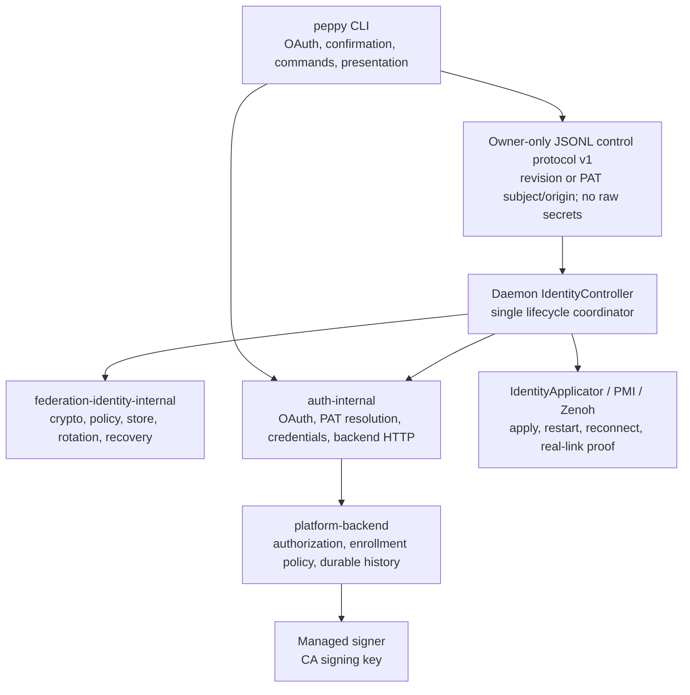

# ADR 0001: Daemon-owned certificate management

- Status: Accepted
- Date: 2026-07-19
- Scope: `peppy`, `public-peppy-libs`, and `platform-backend`
- Format decision: clean-break credentials `"version": 1` and local control
  protocol v1

## Context

Production federation uses one short-lived mutual-TLS identity per Peppy core
node. Peppy generates each private key locally, sends only a
proof-of-possession CSR to `platform-backend`, independently validates the
returned certificate, stores immutable generations, reloads the managed Zenoh
router, verifies its real upstream link, and commits or rolls back the
rotation.

Those security properties are required. The ownership model needed to change:
certificate mechanics were concentrated in `auth-internal`, while CLI and
daemon paths could both mutate the same certificate state. Cross-process
rotation leases, cancellation hand-offs, and recovery branches consequently
had to coordinate two normal writers.

No credentials format from this implementation has been deployed to
production. The persisted document therefore begins at `"version": 1`; this
decision includes no format migration or compatibility writer.

## Decision

Certificate management remains inside the Peppy distribution. It is split
between a focused private Rust crate and a daemon `IdentityController`:

- `federation-identity-internal` owns certificate mechanics: model, policy,
  key/CSR operations, validation, protected storage, rotation, and recovery.
- `IdentityController` is the sole normal coordinator and writer of Peppy-owned
  certificate identity state. It serializes enrollment, rebinding, renewal,
  router application, recovery, and logout.
- The CLI owns OAuth/browser interaction, confirmation, commands, and
  presentation. A fresh OAuth exchange publishes its session and opaque
  revision, then delegates certificate work to the daemon. It does not generate
  keys, write generations, activate identity metadata, or perform normal
  certificate cleanup.
- `auth-internal` owns OAuth, PAT resolution, strict credentials storage,
  authenticated backend HTTP, and translation between backend and identity
  types.
- `public-peppy-libs` owns transport behavior: typed TLS configuration, managed
  router rewrite/restart, retained-session reconnection, stable router ZID, and
  proof of the configured upstream link.
- `platform-backend` owns authorization, enrollment and deletion policy, CSR
  validation, server-authoritative certificate profiles, durable history,
  discovery gating, and signer integration.
- The separately operated managed signer retains the CA signing key. Neither a
  Peppy client nor the main backend process receives it.

No separate deployed identity agent is introduced. A provider interface can be
added later if Peppy needs workload attestation, hardware-backed keys, or
identities shared by several processes.



## Security and lifecycle invariants

Every implementation must preserve these properties:

1. Private keys are generated locally and never sent to the backend.
2. Every production core node has a distinct private key and certificate.
3. A certificate is bound to the platform origin, authenticated subject,
   workspace, exact running core-node name, and locally generated public key.
4. Peppy independently validates the returned chain, leaf profile, bindings,
   usages, validity, serial, and key match before use.
5. Every rotation uses a fresh key and a new immutable generation path.
6. New material is staged before the active pointer changes.
7. For a managed router, reload and proof of the actual configured mTLS link
   happen before rotation commit.
8. A failed rotation restores a still-valid prior generation where possible.
   Rejected files remain until router restoration is confirmed.
9. Expiry causes explicit managed-router de-federation. Failure to prove
   standalone operation remains visible and retryable.
10. There is no unauthenticated or one-way-TLS fallback.
11. Crash recovery produces either a valid, verified identity or explicit
    standalone operation; it never guesses which generation won.
12. OAuth tokens, PATs, private keys, CSRs, and certificate PEM never appear in
    logs, metrics, or local-control responses. Wire-facing errors are sanitized;
    detailed non-secret failures remain daemon-local.
13. Development and production trust paths remain compile-time separated.
14. An explicit custom CA bundle is an exclusive trust store, not an addition
    to system roots.
15. Control-plane certificate deletion does not imply immediate data-plane
    revocation, and the absence of router-side workspace ACL enforcement remains
    documented.

## Persisted contracts

### Credentials version 1

`credentials.json5` is a strict document with `"version": 1`. It may contain:

- one cached OAuth session;
- an opaque UUID `session_revision` required whenever that session exists;
- cached platform-router discovery data; and
- a non-secret mirror of active core-node certificate metadata.

A PAT is never persisted. Private keys and certificate PEM live only in the
protected identity generations.

Every fresh OAuth login creates a new revision, even for the same account.
Proactive and reactive token refresh preserve that revision. Logout removes the
session and therefore its revision. Malformed, unversioned, or differently
versioned documents are errors and are left byte-for-byte untouched; writers do
not heal them into a default document.

The CLI sends only the expected revision with an OAuth enrollment or logout
request. The daemon rereads current credentials and rejects a mismatch. It also
checks the revision after authenticated issuance and before publishing the
chain, rotation receipt, or active pointer. A late response for a replaced
same-subject session is discarded rather than activated.

### Identity generations and recovery receipts

Peppy-owned certificate material lives below
`<PEPPY_HOME>/conf/platform-core-node/`:

```text
platform-core-node/
├── identity.json5
├── pending.json5
├── unverified-rotation.json5
└── generations/
    └── <generation-id>/
        ├── client-key.pem
        └── client-chain.pem
```

`identity.json5` is the atomic pointer to the active immutable generation.
`pending.json5` records staged key material. `unverified-rotation.json5` is a
durable receipt written before active-pointer publication. Startup recovery
uses the receipt and pointer together to distinguish an activated generation, a
restored prior generation, and an ambiguous state requiring standalone
operation. Successful commit removes the receipt and prunes generations only
after router verification.

Protected directories are owner-only (`0700`); credentials, metadata, keys,
chains, pending state, and receipts are owner-readable/writable only (`0600`).
Store operations reject unsafe ownership, unexpected file types, and symlinks,
and publish metadata atomically with filesystem durability.

## Local identity-control protocol v1

Normal login and logout require a running daemon. Before OAuth, PAT validation,
configuration completion, or credential mutation, the CLI sends a `hello`
request over the local identity-control socket.

Protocol v1 uses one UTF-8 JSON request line and one UTF-8 JSON response line.
Every envelope carries `protocol_version: 1` and rejects unknown fields. The
operations are:

- `hello`;
- `prepare_oauth_login`, with the not-yet-published session revision;
- `enroll_current_credential`, with either that OAuth revision or the
  non-secret PAT subject and canonical API origin validated by the CLI;
- `logout`, with an optional expected session revision; and
- `status`.

The request line is limited to 16 KiB, the response line to 64 KiB, and public
error text to 2 KiB. A terminating newline and one total operation deadline are
required. The runtime directory is mode `0700`, the socket is mode `0600`, and
the daemon validates same-effective-UID peers where the operating system
provides reliable peer credentials.

The wire contains no bearer token, refresh token, PAT, private key, CSR,
certificate body, or arbitrary core-node name. Responses contain structured,
sanitized state and typed errors such as stale session revision, missing
authentication, missing daemon PAT, active PAT, busy, unavailable, and deadline
exceeded. A protocol mismatch is an actionable restart error; the CLI never
falls back to direct certificate-store writes.

## Controller lifecycle

The controller owns the following conceptual transitions:

```text
Standalone -> Enrolling -> Staged -> Applying -> Active
Active     -> Enrolling                         -> Active   (renewal)
Applying  -> previous verified Active or Standalone        (rollback)
Any stable state -> LoggingOut -> Standalone
```

Renewal scheduling, bounded retry backoff, hard-expiry handling, command
serialization, and router coordination remain in the controller. Certificate
validity and deterministic renewal jitter remain identity policy.

### Login and enrollment

For OAuth login:

1. The CLI completes the protocol-v1 handshake.
2. It runs browser/device OAuth, then asks the daemon to durably mark the
   binding transition incomplete and apply standalone before publishing the
   new authentication state.
3. It atomically publishes the new session only if that revision still owns the
   transition, resolves `/me`, compare-and-swaps display fields into that exact
   session, and sends
   `EnrollCurrentCredential { expected_session_revision }`.
4. The daemon rereads the exact session, validates the revision, derives its
   startup API origin and immutable running core-node name, generates a new key
   and CSR, enrolls, validates, stages, and activates the generation.
5. A managed `IdentityApplicator` rewrites and restarts the local router, waits
   for retained sessions to reconnect, and verifies the actual upstream link.
6. The controller commits only after verification, or restores a valid prior
   generation and link. With no valid identity it applies standalone.

If authentication succeeds but enrollment fails, the OAuth session remains
available for retry and the managed router is forced standalone rather than
reusing an identity that is not bound to that exact session revision.

For PAT login, the request carries no PAT and no session revision. It carries
the CLI-validated non-secret subject and canonical API origin; the daemon
requires both to match its own independently validated service credential and
startup origin. The daemon uses `PEPPY_API_KEY` from its own service
environment. If it is absent, the operation returns a specific configuration
error. PAT precedence applies to daemon enrollment, renewal, and federation
discovery, and no PAT is ever written to disk.

### Renewal, apply, and rollback

The daemon wakes at the earlier of router-cache maintenance, certificate
renewal, hard expiry, or a bounded retry deadline. Every renewal generates a
fresh private key. A managed-router apply must preserve its ZID, render the
generation's endpoint-local TLS paths, restart safely, wait for retained local
sessions, and verify the configured real link.

An issuer or network failure leaves a still-valid prior identity active and
retries with bounded backoff. The controller never extends certificate
validity. Once no valid identity remains it explicitly applies standalone and
continues retrying. An interrupted rotation is recovered from its durable
receipt under daemon ownership before normal maintenance resumes.

### Normal logout

Normal logout is one controller command. It:

1. rejects an active PAT in either process environment;
2. validates the expected OAuth session revision;
3. attempts remote certificate deletion while authentication is available;
4. attempts OAuth token revocation;
5. applies standalone to a Peppy-managed router;
6. clears Peppy-owned certificate generations, identity metadata, router cache,
   and session; and
7. reports remote revocation, router disposition, and local cleanup separately.

Remote cleanup is best effort and does not prevent fail-closed local cleanup.
If managed-router de-federation fails, Peppy attempts to stop that router before
discarding usable identity material. A confirmed fallback stop reports
standalone operation; only an unconfirmed stop reports uncertain shutdown and
requires operator action. A namespace change is acknowledged before the daemon
starts its in-process restart.

### Offline recovery

`peppy platform logout --offline` is the only normal CLI entry point allowed to
mutate Peppy-owned identity state without daemon control. It is explicit and is
never selected automatically after a control failure.

The offline path:

1. refuses an ambient PAT;
2. proves the daemon is stopped using both its state and control socket;
3. acquires the same process-lifetime identity-owner lock used by the daemon;
4. proves the daemon is still stopped while holding that lock;
5. uses the shared auth and identity APIs rather than duplicating filesystem
   manipulation;
6. attempts remote deletion only with a valid stored OAuth session; and
7. distinguishes remote failure from successful local deletion.

A live owner, live control responder, or ambiguous liveness result aborts
without mutation. Orphaned local cleanup is permitted when no OAuth session is
available. After those checks, this recovery path may reset a malformed or
unsupported credentials document so orphaned renewable state can be removed;
normal writers never do so.

## Locking model

The daemon acquires one stable identity-owner lock above its supervised restart
loop and retains it for the process lifetime. The controller's single command
loop serializes lifecycle operations; a bounded channel rejects excess
concurrent commands instead of running another mutation. Short credentials and
identity-store locks remain only around atomic filesystem transactions;
durable receipts and immutable generations remain necessary for crash
recovery.

The hierarchy is:

```text
daemon lifetime identity-owner lock
  -> serialized identity-controller command loop
    -> short store transaction
```

Offline maintenance acquires the same owner lock, so it cannot overlap daemon
recovery or renewal and daemon startup cannot enter while offline cleanup owns
the store.

## Router ownership modes

`IdentityApplicator` separates certificate lifecycle from router mechanics.

For `zenoh.managed`, Peppy renders TLS paths, rewrites and restarts the bundled
router, waits for retained sessions, and verifies the actual outbound link. A
pinned `ZENOH_CONFIG` is reported as operator-managed rather than falsely
verified.

For `zenoh.external`, the daemon still owns enrollment, renewal, Peppy-local
storage, revocation, and cleanup. The operator-managed applicator never rewrites,
restarts, stops, or verifies the external router. Login and status do not claim
the identity was installed or the link established. Logout clears Peppy-owned
state and tells the operator to remove any separately installed material; it
does not claim external-router de-federation.

## Status and observability

The control socket answers status from an in-memory watch rather than queuing
behind an identity operation. The current `peppy platform federations` report
keeps these dimensions separate:

- daemon-reported platform endpoint and actual link state;
- managed, pinned, or external/operator-managed router ownership;
- certificate state (`missing`, `valid`, `renewing`, `expiring`, or `expired`);
- bound core-node name and certificate expiry;
- latest sanitized certificate maintenance error; and
- live core nodes whose hub paths can be inferred only when Peppy owns the
  topology.

No endpoint alone is evidence of federation; only a daemon-verified link yields
`federated`. No identity-bearing values are suitable as metric labels. Events
for enrollment, renewal, rollback, receipt recovery, expiry de-federation,
router apply/verification latency, stale revisions, and offline owner conflicts
must use bounded outcome labels and must not include account IDs, workspace IDs,
core-node names, certificate serials, or fingerprints.

## Known limitations

- Certificate deletion and token logout are control-plane revocation. The
  current router has no dynamic CRL/OCSP enforcement, so copied still-valid
  material and an already-established hostile connection remain bounded by
  leaf expiry rather than immediate database state.
- The production router validates the client chain but does not yet enforce the
  workspace URI as a router-side authorization boundary. Routing namespaces are
  not a tenant security boundary.
- Backend workspace mapping uses authenticated backend state. Peppy also binds
  the API origin in protected local metadata and the authenticated HTTP
  boundary.
- Peppy cannot prove installation, reload, or de-federation of an external
  router identity. That state remains the operator's responsibility.

## Consequences

Positive consequences:

- Normal certificate mutation has one process owner and one serialized state
  machine.
- Certificate mechanics can be tested without a CLI, daemon, backend HTTP
  client, or real router.
- The local socket is a narrow capability boundary rather than a trigger to
  inspect partially mutated shared state.
- Router behavior remains reusable transport infrastructure rather than
  acquiring authentication policy.
- Fresh-login revisions close delayed same-subject enrollment races.
- A future workload-identity provider seam does not require deploying another
  service today.

Costs:

- Normal login and logout require a running compatible daemon.
- OAuth interaction remains in the CLI, so credential updates and daemon-owned
  certificate updates share an atomic storage boundary even though certificate
  lifecycle has one coordinator.
- A daemon-owned design still requires the explicit locked offline cleanup
  path.
- Durable receipts, immutable generations, and recovery remain necessary after
  normal writes are serialized.
- External-router application and revocation cannot be verified by Peppy.

## Verification gates

The Peppy repository retains these primary gates:

```sh
cargo fmt --all -- --check
cargo test --locked
cargo test --locked -p core-node --features container_e2e --test container_e2e
cargo test --locked -p peppy --features multi_daemon_e2e --test multi_daemon_e2e
cargo test --locked -p docs-integration-tests
(cd docs && npm ci && npm run build)
./scripts/check_federation_mtls_release.sh
git diff --exit-code -- Cargo.lock
```

Coordinated release verification must also cover the release-mode PMI suite and
patched-policy marker, backend formatting/build/clippy/tests and production
artifact checks, real OAuth and PAT enrollment, distinct per-node keys,
rotation and rollback, hard-expiry de-federation, logout, external-router
reporting, and fault injection around every durable rotation boundary.
